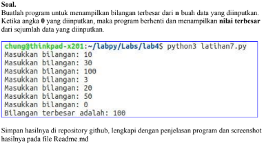
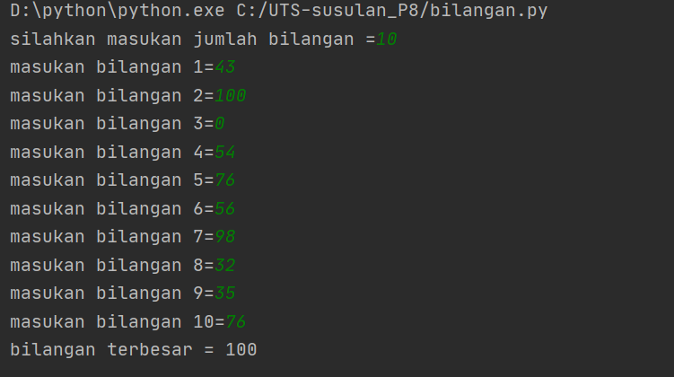

# UTS-susulan-Pertemuan-8


### NAMA  : Yogi Wiji Pangestu <br>
### NIM   : 312010079 <br>
### KELAS : TI.A1.20 <br>



**Untuk mengerjakan soal diatas maka kita perlu memasukan atau menginput datanya terlebih dahulu baru setelah itu bisa terlihat data mana yang terbesar dengan syntax.** <br>

```python**Untuk mengerjakan soal diatas maka kita perlu memasukan atau menginput datanya terlebih dahulu baru setelah itu bisa terlihat data mana yang terbesar dengan syntax.** <br>
N=int(input("silahkan masukan jumlah bilangan ="))
if N>0:
    i=1
    x=int(input("masukan bilangan "+str(i)+"="))
    max=x;total=x
    for i in range(2,N+1):
        x=int (input("masukan bilangan "+str(i)+"="))
        total+=x
        if max<x:
            max=x

    print("bilangan terbesar =",max)
```

**Setelah itu bisa langsung kalian "RUN" untuk dapat memasukan data yang sesuai dengan yang ada di soal seperti dibawah ini** <br>


###SEKIAN DARI SAYA TERIMAKASI 
